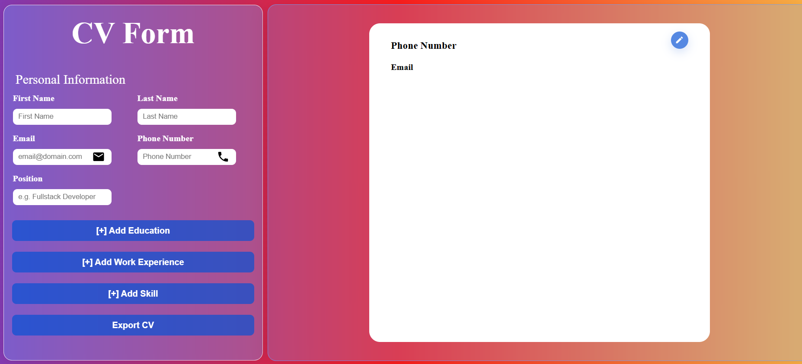

# CV Builder (React Assignment)

A React-based web application that allows users to create and preview professional resumes in real-time. 

## 🎯 Project Purpose
This project was developed as part of a React course. While the functional requirements were provided as a task description, the **UI/UX design and component architecture were created entirely from scratch**. 

The goal was to transform a set of requirements into a functional, user-friendly tool without following a step-by-step visual tutorial.

## 🚀 Key Features
* **Real-time Live Preview:** Changes made in the form are instantly reflected in the CV document layout.
* **Dynamic Sections:** Ability to add, edit, and remove multiple entries for Work Experience and Education.
* **Modular Architecture:** The interface is broken down into small, specialized components for better maintainability.
* **Custom Design:** A clean, minimalist interface focused on readability.

## 🧠 Technical Learning Objectives
The primary focus of this project was to master core React concepts:
* **State Management:** Using `useState` to handle complex, nested objects (personal info, experience lists, education).
* **Lifecycle & Effects:** Implementing `useEffect` to manage data synchronization and side effects.
* **Form Handling:** Managing controlled components and ensuring proper data flow between parent and child components.
* **Component Composition:** Organizing the project structure to follow the principle of "Single Responsibility."

## 🛠 Tech Stack
* **Frontend:** React.js
* **Styling:** CSS3 (Custom styles)

## 📸 Preview

---
