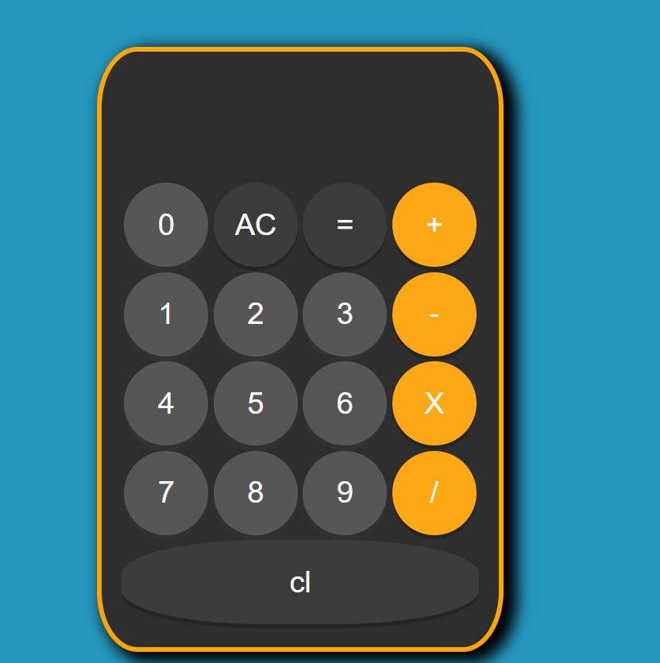

# Calculator 

This project is an interactive calculator developed as part of a training course to deeply study and practice working with Event Listeners in JavaScript.

## 📌 Project Objective
The main task was to implement the calculator logic "from scratch" using Vanilla JavaScript based on the provided task conditions. The focus was on:
* Optimizing DOM manipulation.
* Implementing Event Delegation.
* Handling user input and mathematical operations.

## 🛠 Tech Stack
* **HTML5**: Calculator structure.
* **CSS3**: Interface styling.
* **JavaScript (ES6+)**: Calculation logic and event management.

## 🚀 Key Features
* **Arithmetic Operations**: Addition, subtraction, multiplication, division.
* **Input Handling**: Support for UI-based input.
* **Reset (AC)**: Full clear of the current state.
* **Calculation Logic**: Correct storage of operands and operators until the result is triggered.

## 🧠 Core Skills & Concepts
During development, the following JS aspects were mastered:
1.  **Event Listeners**: Assigning handlers to buttons and managing the event flow.
2.  **State Management**: Maintaining current values, previous values, and selected operators.
3.  **Edge Cases**: Handling division by zero and preventing multiple decimal points in a single number.

## 📸 Preview

---
*Project completed independently based on the provided technical requirements.*