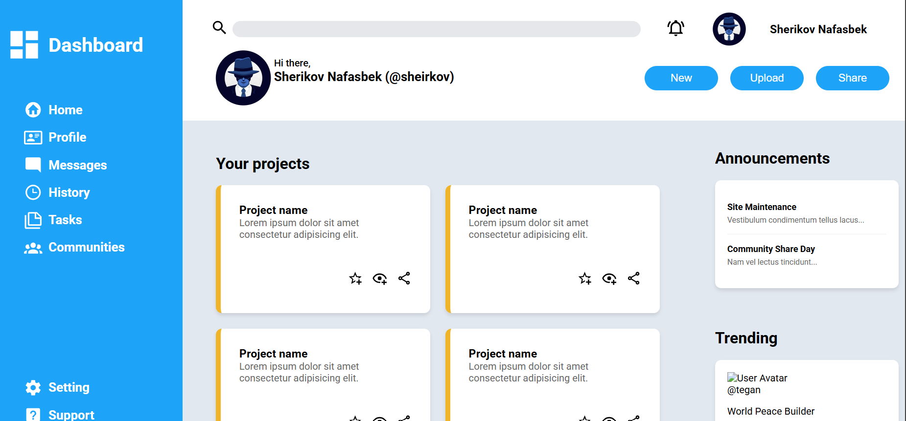

# Dashboard Layout

A frontend implementation of a dashboard interface built precisely to a provided UI mockup. 

## 🎯 Project Purpose
This project was developed to practice and solidify my understanding of modern CSS layout systems and document structure. The goal was to accurately translate a static design into a functional layout without relying on CSS frameworks.

## 🧠 Technical Learning Objectives
* **CSS Grid Mastery:** Using `display: grid` to construct a complex, two-dimensional dashboard layout. This includes managing structural areas like sidebars, headers, and grid-based content widgets.
* **Semantic HTML5:** Structuring the markup with proper semantic tags (e.g., `<main>`, `<aside>`, `<nav>`, `<section>`, `<header>`) rather than building a "div soup". This approach improves document readability, maintainability, and accessibility.
* **Mockup Implementation:** Honing the skill of reading a design file and reproducing it accurately in code, maintaining intended proportions and spacing.

## 🛠 Tech Stack
* **HTML5:** Focused on semantic structure.
* **CSS3:** Focused heavily on Grid architecture.

## 📸 Preview

---
