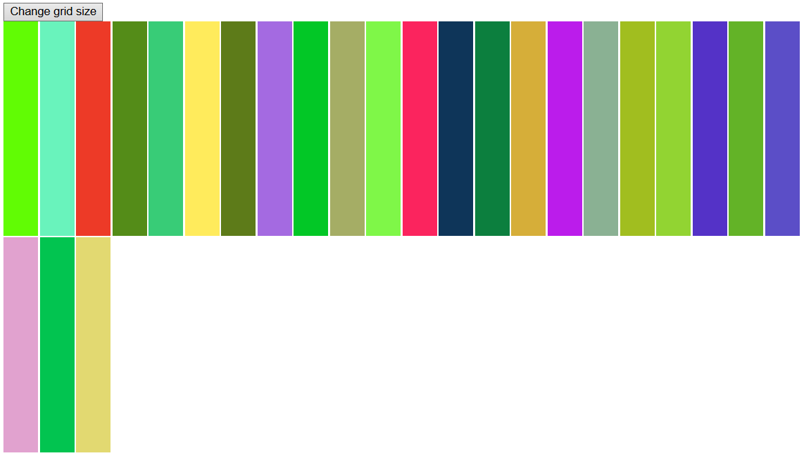

# 🎨 Etch-a-Sketch

A browser-based sketch pad created as part of **The Odin Project**. This project focuses on DOM manipulation and event listeners.

## 🎯 Features

* **Dynamic Grid**: Users can change the resolution of the grid (e.g., 16x16, 64x64) via a prompt.
* **Hover Effect**: Drawing is achieved by hovering the mouse over grid cells.
* **Color Modes**:
  * **Black Mode**: Standard sketching.
  * **Rainbow Mode**: Assigns a random RGB color to each cell.
  * **Shader Mode**: Progressively darkens the cell by 10% on each pass.
* **Reset**: A button to clear the grid and start over.

## 🛠️ Built With

* **HTML5**
* **CSS3** (Flexbox)
* **Vanilla JavaScript**

## 🧠 What I Learned
* Manipulating the DOM to create a grid of divs dynamically.
* Understanding capturing and bubbling phases of standard DOM events.
* Using CSS Flexbox to ensure the grid remains square regardless of resolution.

## 📸 Preview
