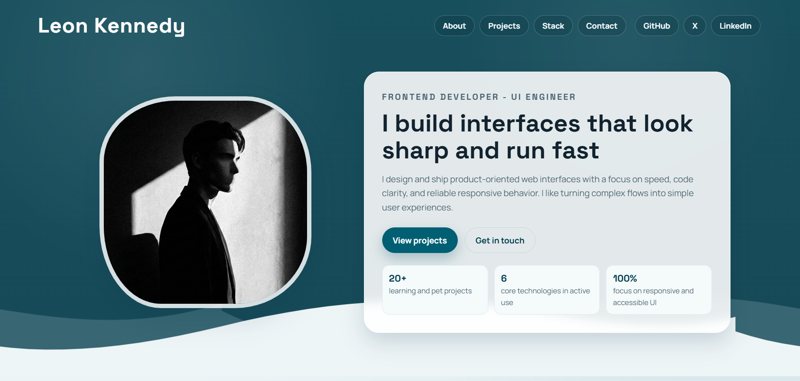

# Homepage Implementation

A custom-designed homepage built from ground up based on functional text requirements.

## 🎯 Project Purpose
This project was developed to practice configuring modern build tools and implementing smooth UI interactions. The visual layout was designed independently, translating a pure text description into a functional web interface without a pre-existing design file.

## 🧠 Technical Learning Objectives
* **Module Bundling:** Setting up and using **Webpack** to bundle assets, process styles, and manage dependencies, moving away from simple `<script>` tag inclusions.
* **CSS Motion & Interactivity:** Implementing CSS `transition` and `@keyframes` animations to create smooth, purposeful interactions and visual feedback for user actions.
* **Requirements Translation:** Interpreting written functional requirements into a cohesive UI/UX design.

## 🛠 Tech Stack
* **Build Tool:** Webpack
* **Markup & Styling:** HTML5, CSS3 (Animations & Transitions)
* **Design:** Custom Layout

## 📸 Preview

## ⚙️ How to Run Locally
1. Clone the repository.
2. Navigate to the project directory: `cd Homepage`
3. Install dependencies: `npm install`
4. Start the development server: `npm start` 
5. Build for production: `npm run build`

---
