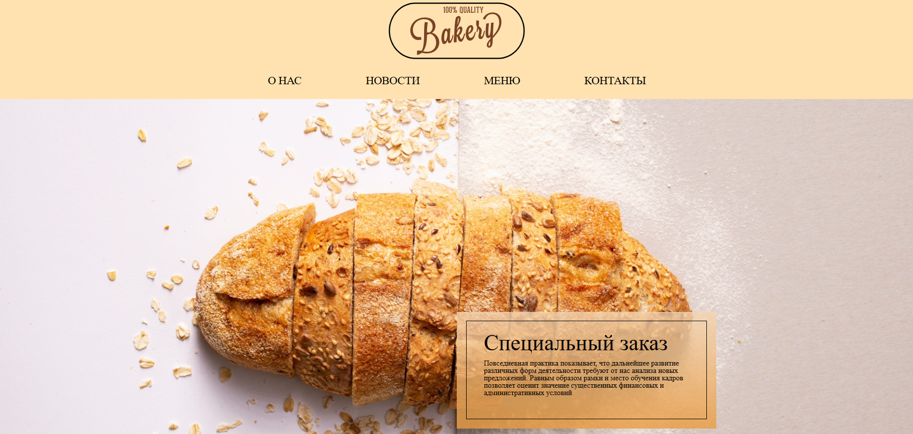
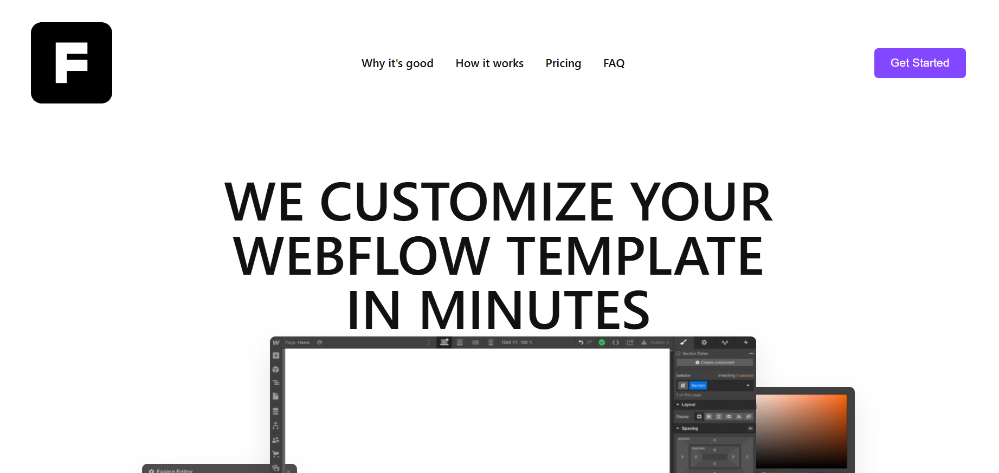
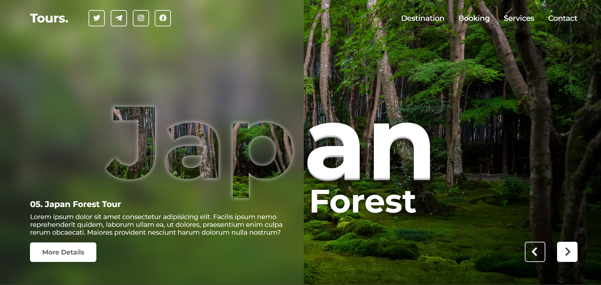
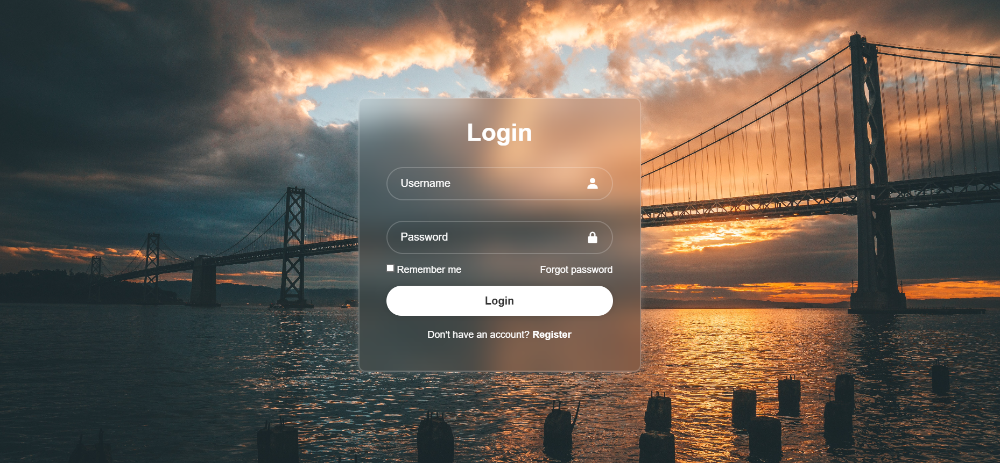
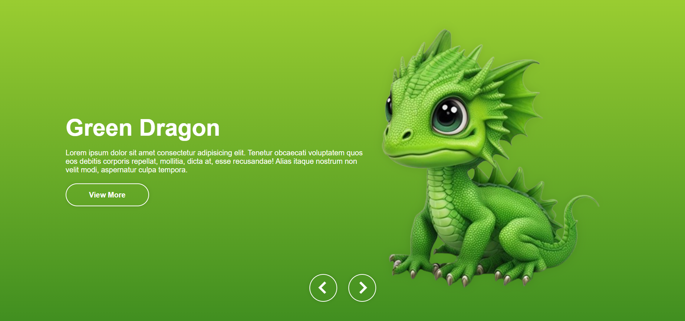
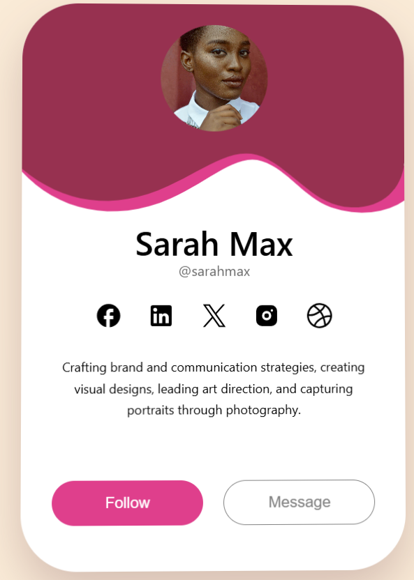

# 🎨 Landing Page Collection

A curated gallery of single-page websites and landing pages developed to master precise layout implementation, responsive design, and CSS architecture.

## 🎯 Purpose
The main goal of this collection is to practice translating complex design mockups into clean, semantic code. These projects range from pure CSS layouts to interactive pages with JavaScript components.

## 🖼️ Gallery & Project Showcase

| Project |  Tech Stack | Preview |
| :--- | :--- | :--- |
| **BakeryShop** | HTML, CSS |  |
| **Designers' website** |  HTML, CSS, Flexbox, Animation |  |
| **Forest** | HTML, SASS, JS, Slider |  |
| **Robo-school** | HTML, SASS, JS|  |
| **Sign up form** | HTML, CSS  |  |
| **Slider** | HTML, CSS, JS, Slider |  |
| **UI ProfilCard** | HTML, CSS, React, webpack |  |

## 🧠 Core Competencies
* **Pixel Perfect Implementation:** Focus on matching the original mockup spacing, typography, and proportions.
* **Responsive & Adaptive:** Using Media Queries and fluid layouts (Flex/Grid) to ensure the design works on all screen sizes.
* **Asset Optimization:** Efficient handling of images, icons (SVG), and custom web fonts.

## 🛠 Tech Used
* Semantic HTML5
* CSS3 (Flexbox, Grid, Animations, Custom Properties)
* JavaScript (ES6+) for interactive elements

---
