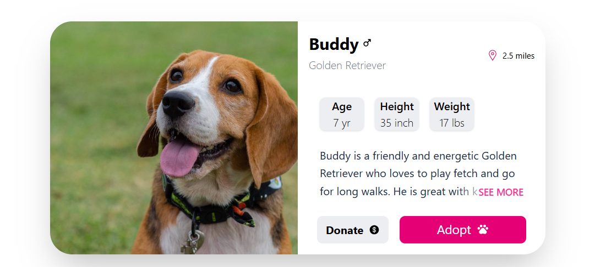

# PetUI Card

A responsive UI card component built within the Learning Sandbox repository.

## Purpose

The primary objective of this project is to practice and solidify skills in building layouts and styling using **Tailwind CSS**.

## Design Origin

The design mockup for this component was sourced from [Big Dev Soon](https://app.bigdevsoon.me/challenges/fur-friends/browser). 

## Tech Stack

* HTML5
* React
* Tailwind CSS

## Preview

