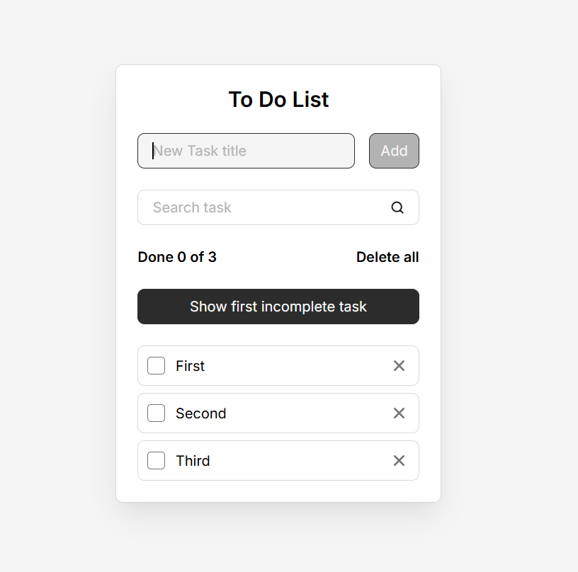

# React To-Do Application

A task management application built to explore the fundamentals of the React library and its component-based architecture. The visual design was provided as part of a guided video course.

## 🎯 Project Purpose & Context
Rather than simply reproducing code from a tutorial, the primary objective of this project was to understand the end-to-end process of building a React application. 

Having previously built a similar To-Do application using Vanilla JavaScript, this project served as a direct comparative study. It highlighted the practical differences between imperative DOM manipulation and React's declarative state-driven UI.

## 🧠 Core Concepts Explored
* **Declarative UI:** Understanding how React automatically updates and renders the right components when data (state) changes, eliminating manual DOM queries (`document.querySelector`, etc.).
* **Component Architecture:** Breaking down the UI into functional, independent pieces (e.g., Input Form, Task List, Task Item).
* **State Management & Props:** Using `useState` to store application data and passing functions/data down the component tree via props.
* **List Rendering:** Handling arrays of data in JSX and understanding the critical importance of unique `key` props for performance and state consistency.

## 🛠 Tech Stack
* **Frontend:** React.js
* **Styling:** CSS3

## 📸 Preview

---
