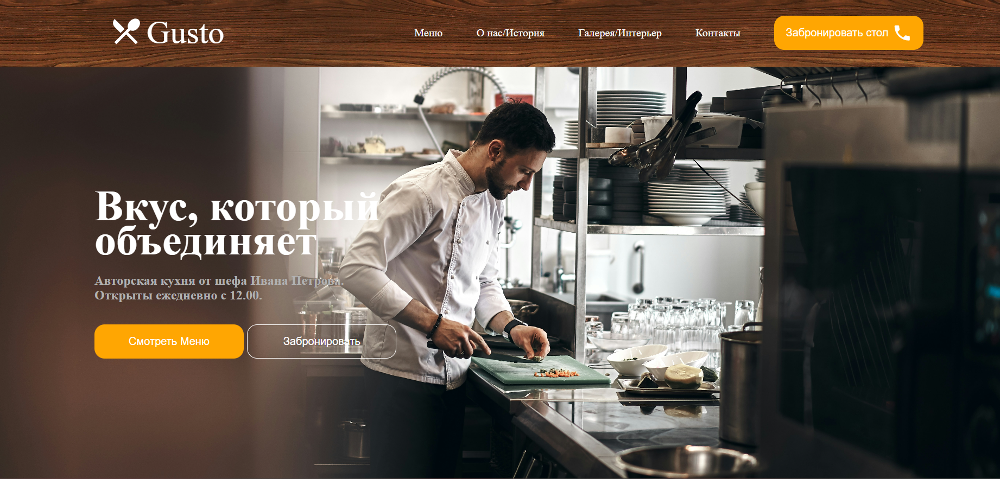

# 🍽️ Restaurant Page

A dynamic restaurant website built as part of **[The Odin Project](https://www.theodinproject.com/)** curriculum.

The primary goal of this project was to practice configuring **Webpack** from scratch and mastering **ES6 Modules**. Unlike traditional static websites, the entire DOM for this page is generated dynamically via JavaScript; the initial HTML file contains only a single `<div id="content">`.

## 🎯 Learning Objectives

This project focuses on the following concepts:
* **Webpack Configuration**: Setting up entry points, output paths, and plugins (e.g., `HtmlWebpackPlugin`) manually.
* **Asset Management**: Using Webpack loaders (`style-loader`, `css-loader`, `asset/resource`) to handle CSS, images, and fonts.
* **DOM Manipulation**: Rendering the UI completely through JavaScript without hardcoding HTML.
* **ES6 Modules**: Organizing code into separate logic modules (Home, Menu, Contact) and importing them into the main entry point.

## 🛠️ Built With

* **JavaScript (ES6+)**
* **Webpack 5**
* **npm**
* **HTML5 / CSS3**

## 📸 Preview


## 🚀 Getting Started

To run this project locally on your machine, follow these steps:

1.  **Clone the repository:**
    ```bash
    git clone [https://github.com/Sherikov/Learning-sandbox.git](https://github.com/Sherikov/Learning-sandbox.git)
    cd Learning-sandbox/Restaurant-page
    ```

2.  **Install dependencies:**
    Make sure you have Node.js installed, then run:
    ```bash
    npm install
    ```

3.  **Build the project:**
    To compile the source code into the `dist` folder:
    ```bash
    npm run build
    ```

4.  **Development Mode:**
    If you want to run the project with a local server (and if `webpack-dev-server` is configured):
    ```bash
    npm start
    # or
    npm run dev
    ```

## 📂 Project Structure

```text
Restaurant-page/
├── dist/               # Compiled files (generated automatically)
├── src/                # Source code
│   ├── assets/         # Images and fonts
│   ├── modules/        # Page logic (Home, Menu, Contact)
│   ├── style.css       # Stylesheets
│   └── index.js        # Main entry point
├── package.json        # npm dependencies and scripts
└── webpack.config.js   # Webpack configuration settings
```

## ✨ Features
    Tabbed Navigation: Seamless switching between Home, Menu, and Contact tabs without page reloads.
    Dynamic Content: Content is cleared and re-rendered via DOM manipulation upon tab switching.

<hr>
Author: Sherikov Nafasbek