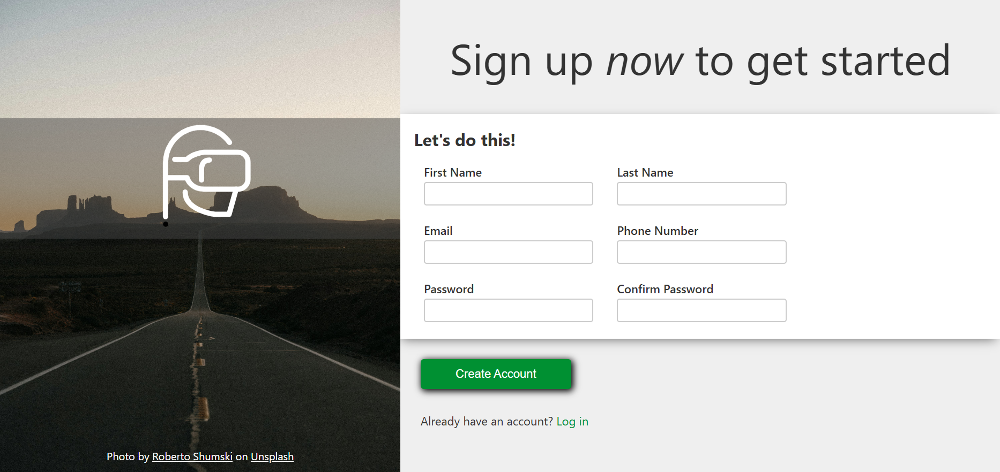

# Sign-Up Form Component

A responsive and accessible sign-up form built to practice layout techniques, data capture, and client-side validation.

## 🎯 Project Context
This project was initially developed as a course assignment. While the structural mockup was provided, the visual assets (background imagery and icons) were custom-selected and integrated to refine the overall aesthetic.

## 🧠 Technical Learning Objectives
The primary goal of this project was to master how web forms operate at the document level:
* **Semantic Form Structure:** Proper implementation of `<form>`, `<label>`, `<input>`, and other relevant tags to ensure correct data submission behavior and accessibility.
* **Client-Side Validation:** Utilizing native HTML5 validation attributes (such as `required`, `pattern`, `type="email"`, `minlength`) to enforce data integrity before submission.
* **Form Styling & State Management:** Overriding default browser styles for form controls and utilizing CSS pseudo-classes (like `:focus`, `:valid`, `:invalid`) to provide immediate visual feedback to the user.

## 🛠 Tech Stack
* **HTML5:** Semantic markup and native validation.
* **CSS3:** Custom styling and visual feedback states.

## 📸 Preview

---
