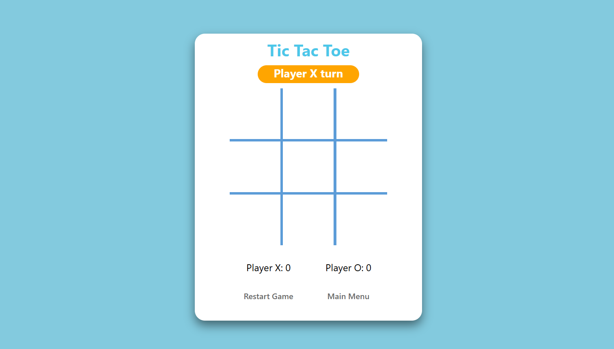

# ❌⭕ Tic-Tac-Toe

A browser-based implementation of the classic Tic-Tac-Toe game. The main focus of this project was to write cleaner code using **Factory Functions** and the **Module Pattern**.

## 🎯 Features

* **Two Player Mode**: Play against a friend locally.
* **PvE**:  Play against AI.
* **Game Logic**: checks for win conditions, ties, and prevents playing on taken spots.
* **Modular Code**: Logic is strictly separated into `Gameboard`, `DisplayController`, and `GameFlow` modules.

## 🛠️ Built With

* **HTML5 / CSS3**
* **JavaScript** (Module Pattern & Factory Functions)

## 🧠 What I Learned
* Minimizing global scope pollution using **IIFEs** (Immediately Invoked Function Expressions).
* encapsulating private variables and functions within modules (closures).
* separating the game logic from the DOM manipulation logic.

## 📸 Preview
